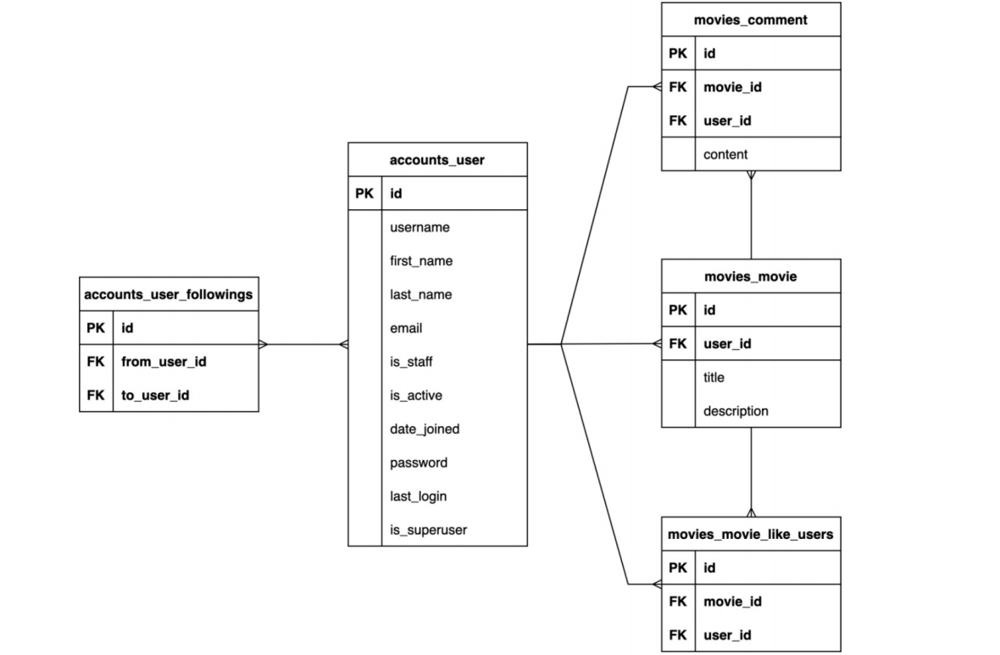

# 좋아요 / 팔로워 페이지 구현

## 프로젝트 설명

### 목적
- 영화 추천 사이트를 제작할 때 추천글을 잘 작성한 유저를 팔로우 하여 팔로우 페이지에 들어갔을 때 팔로우한 유저들의 글을 쉽게 볼 수 있게 하는 목적을 두었습니다.
- 좋아요한 개수에 따라 영화 추천글을 보여주거나 자신이 좋아요한 글들이 무엇이였는지 바로 연결 시켜줄 수 있는 기능을 구현하고자 목적을 두었습니다.

### 느낀점
1. 영화 추천에 있어 해시태그나 영화 장르에 따른 분류만으로 추천을 해야 겠다 라는 목표를 두고 있었는데 좋아요나 팔로우 등 다양한 요소들을 활용해 영화 추천을 할 수 있다는 것을 느낄 수 있었습니다.
2. 현재는 데이터 베이스를 다루고 html 페이지에 띄우는 과정을 한번에 진행하고 있는데 아직은 스켈레톤 코드 처럼 투박한 형태만 제작이 된다는 것을 느꼈습니다. 부트스트랩이나 더 다양한 프론트엔드 프레임 워크를 활용한다면 더 멋진 홈페이지를 만들 수 있을 것이라고 느꼈습니다.
3. 현재는 데이터베이스를 직접 다루기 때문에 큰 문제가 생기지는 않았지만 실제 팀프로젝트를 진행할 경우 제가 다룬 데이터베이스를 전달하거나 소통을 해야하는 상황이 발생하게 되는데 이 때 정의한 함수 명이나 변수명들을 명시적으로 작성하지 않는다면 소통의 오류가 발생할 수 있을 것이라고 느꼈습니다.

### 배운점
1. 좋아요와 팔로우 페이지를 만들면서 기능적인 부분과 새로운 페이지를 만드는 부분에 있어 함수를 다르게 써야 한다는 것을 배울 수 있었습니다.
2. 받는 정보를 POST와 GET 분기로 나누어 페이지를 redirect 할 지 render를 할 지 결정하여 새로운 페이지를 보여주거나 원래 페이지로 돌아가게 하는 방법을 배울 수 있었습니다.
3. 분기점을 나눠 새로운 페이지를 만드려고 할 때 pk도 나눠야 하는 경우 어려움을 겪어 부트스트랩을 이용하여 페이지를 구현하였습니다.

### 사용한 app / framework
- Django 4.2.6
- Django-bootstrap-v5 1.0.5

### 데이터베이스 ERD

### 팀원
- 김선욱 (https://github.com/Woogie-Gim)
- 참고 레퍼런스 (https://korinkorin.tistory.com/31)