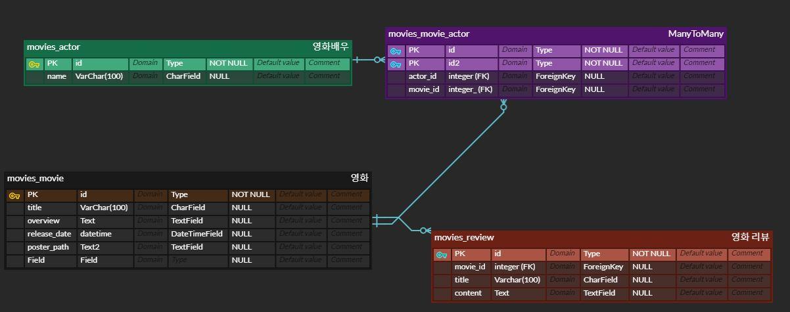

# 프로젝트명 : DB 설계를 활용한 REST API 설계

## 프로젝트 설명

### 동기
- 지금까지 데이터베이스를 활용하여 html페이지에 직접 띄우는 형식으로 진행하였는데 Django framework는 프론트엔드 지향의 framework가 아니기 때문에 백엔드와 프론트엔드의 역할을 명확하게 하고 DB를 프론트엔드 framework에서 구현하기 위해 REST API 설계하고 전달하고자 하는데 목적을 두고 프로젝트를 시작하였습니다.

### 문제 해결

### 코드 사용 방법

- 각 view 함수를 불러와 사용하고자 하는 url을 설정

- 배우들의 전체 정보와 디테일 정보를 조회하기 위해 GET으로 정보를 조회
- 전체 조회에서는 many=True를 작성하여 여러개의 글을 받을 수 있도록 함
- Serializer에서 전체 조회는 fields 전부 조회하게 함
- detail 정보를 조회하기 위해서 ActorSerializer를 선언하고 movie_set을 통해 역참조하여 Movie Title을 출력하고자 함
- MovieTitleSerializer를 추가로 오버라이드 해주고 model을 Movie로 불러옴
- 역참조를 하지만 출력되는 이름을 movies로 하고자 source='movie_set'을 작성해줌

- movie의 경우도 전체 데이터와 디테일 데이터를 조회하고자 GET으로 정보를 받음
- Serializer에서 전체 조회 fields는 전부 조회함
- movie 중개 테이블에 연결되어 있는 actor와 외래키를 받은 review를 detail에 페이지에 출력하고자 함
- actor의 경우 name만 출력하고자 fields에 name만 선언
- ActorNameSerializer를 오버라이드 하여 actors를 선언
- Review에 대한 정보도 출려하기 위해 ReviewSetSerializer 라는 이름으로 오버라이드
- reviews를 소스로 작성하고 review_set 이라는 변수명으로 테이블 명을 변경

- 리뷰의 경우 조회 뿐만 아니라 리뷰 작성, 삭제, 수정의 기능을 넣고자 함
- 전체 리뷰 데이터는 조회만 하기 때문에 GET 정보로 받음
- 디테일 리뷰 데이터는 조회 후 삭제와 수정 까지 이루어져야 하기 때문에 데이터를 GET, DELETE, PUT으로 받고자 하였고 받아진 정보에 따라 조건문으로 분기를 나누어줌
- 삭제 되었을 때 메세지를 띄우기 위해 data라는 정보도 Response 해주어 데이터 삭제 시 메세지가 뜨게 함
- 수정을 할 때 raise_exception을 True로 작성해줌에 따라서 ValidError를 방지하고 500 페이지로 연결되게 함
- review 를 작성하기 위해 POST로 정보를 전달하였고 영화 pk에 따른 리뷰 작성이기 때문에 movie를 정보를 선언하고 serializer는 선언한 ReviewSerializer를 불러와 데이터를 전달함 

### 프로그램 설치
- REST API를 활용하기 위한 djangorestframework 설치
- REST API를 조회, 수정, 생성, 삭제를 위한 POSTMAN 설치

### 사용한 app framework
- Django 4.2.2
- django-seed 0.3.1
- djangorestframework 3.14.0

### 데이터베이스 ERD

- Actor와 Movie를 중개 필드를 통해서 연결
- 영화 리뷰에 대한 정보를 받기 위해 리뷰 모델에 Movie를 외래키로 받음

### 팀원
- 김선욱 (Instagram : @ws_960 / github : https://github.com/Woogie-Gim)

### 참고한 레퍼런스 자료
- https://pgmjun.tistory.com/29