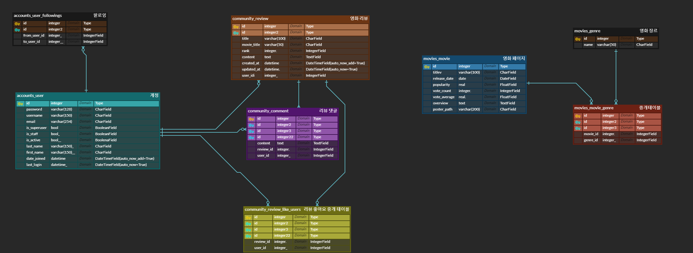

# 비동기 통신을 이용한 웹 사이트 구현
## 프로젝트 설명
### 동기
- 지금까지 모든 페이지의 기능을 동작하기 위해선 새로운 페이지를 렌더하거나 redirect를 통해서 html 페이지를 새롭게 받아왔습니다. 이럴 경우 메모리 등의 다양한 한계점을 보이기 때문에 특정 동작 기능에 대해서는 새로고침을 하지 않고 비동기적으로 동작을 함으로써 효율적인 페이지를 만들고자 프로젝를 시작하였습니다.

## 문제 해결

### 코드 사용방법

#### 1. 커뮤니티 좋아요 기능 구현

- 커뮤니티 좋아요 기능을 구현하기 위한 url 설정
- 각 게시글에 대한 좋아요가 필요하기 때문에 review_pk를 전달

- 좋아요 view 함수 작성
- 기존의 render로 return을 받지 않고 JsonResponse로 좋아요와 좋아요 수를 return 함으로써 비동기 구현

- 각 태그들에 대한 기능을 동작시키기 위해 id를 설정
- 기존에 있던 action과 url들을 제거

- axios cdn을 불러옴
- 기능을 동작하기 위핸 태그들을 지정해 준 후 axios를 통해서 비동기 적인 좋아요 기능 구현
- 또한 좋아요 수를 비동기적으로 동작하게 구현
- 좋아요 가 눌러져 있을 때는 true 임으로 좋아요 버튼의 innerText는 좋아요 취소로 되어 있고 다시 한번 눌렀을 때 false로 변해 반대로 innerText는 좋아요가 되게 설정
- post로 데이터를 받기 위해 csrftoken 작성

#### 2. 유저 팔로우 기능 구현

- follow 기능은 user들의 정보를 통해 구현되어야 하기 때문에 user_pk를 전달

- view 함수 작성
- 팔로워와 팔로잉 유저를 나누어 본인이 본인을 팔로우 못하게 조건을 걸어둠
- 비동기적인 동작을 위해 return reder가 아닌 JsonResponse를 통해서 context를 받음
- 팔로우가 되어 있을 경우 팔로우 취소 기능과 반대로 안되어 있을경우 팔로우를 하는 것을 is_followed 로 받음
- 팔로워 수와 팔로잉 수를 구현하기 위해 context로 받음

- 팔로우를 하기 위한 follow form과 data-user-id를 작성
- 팔로워, 팔로잉 수를 표현하기 위해 span태그에 id를 작성

- axios cdn 작성
- 'post' 정보이기 때문에 csrftoken을 받음
- 작성된 id로 기능이 동작할 태그들을 지정함
- axios를 통해서 비동기적인 동작을 수행하게 함 팔로우가 되어 있을 경우 언팔로우를 할 수 있게 false로 전환하고 반대의 경우 true로 전환하여 팔로우를 하게 만듦
- followings-count와 followers-count id를 지정하여 팔로워 수와 팔로잉 수 또한 표현해줌

### 3. 영화 소개 페이지

- 영화에 대한 정보를 받기 위한 model
- 제목, 개봉일 등 다양한 정보를 model로서 받음
- genre 필드를 중개필드로서 사용함
- 포스터에 대한 정보는 poster_path를 통해서 text로 받아옴

- 메인 페이지와 detail 페이지에 대한 url

- view 함수 작성
- 메인 페이지와 detail페이지에 대한 view 함수
- 중개 테이블인 genre와 movie에 대한 정보를 각각 받아옴

- 영화 메인 페이지는 부트스트랩을 이용하여 카드로 표현하였음
- 영화 포스터는 이미지 src에 텍스트로 전달하였음
- 영화 제목 overview 등을 카드에 표시
- overview는 글자 수가 제각각이기 때문에 필터를 통해 100자로 제한함

- 영화에 대한 상세 정보 페이지
- 상세정보에선 overview에 대한 모든 정보를 확인할 수 있게 필터를 사용하지 않음
- 각 영화에 대한 자세한 정보를 확인할 수 있게 함

#### 4. 영화 추천 기능

1. 장르 별 영화 소개

- 영화 추천 페이지에서 장르명을 url로 받아옴

- 영화 상세 페이지에서 각 장르에 대해서 recommend 페이지 장르 별 페이지로 연결
  

- 장르를 url로 받아 각 장르에 대한 영화를 다시 추천 페이지에서 정렬함으로써 장르별로 원하는 영화를 추천할 수 있게 구현함

- 메인 페이지에서도 장르별 추천 영화를 볼 수 있게 연결 해놓음

2. 인기순 정렬

- 영화를 추천하는데 있어 인기순은 중요한 지표라고 생각함
- 메인페이지에서 인기순, 영화 투표 순으로 정렬하는 기능을 구현함
- view 함수에서 정렬할 수 있는 인자들을 context로 전달함
- 인덱스 html에서 정렬 기능을 select와 button을 통해서 구현
- JavaScript를 활용하여 이벤트가 동작될 부분을 지정해준 이후 비동기적인 동작을 위해 DOMContentLoaded를 활용하여 기능을 부여함
- 버튼을 클릭했을 때 정렬되게 기능을 동작함

### 최종 결과물

### 사용한 app framework
- Django 4.2.2
- Django-seed 0.3.1
- Django-bootstrap-v5 1.0.5

### 데이터베이스 ERD

### 팀원
- 김선욱 (Instagram : @ws_960 / github : https://github.com/Woogie-Gim)
