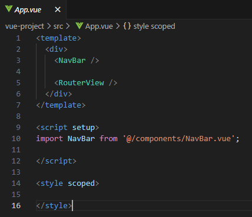
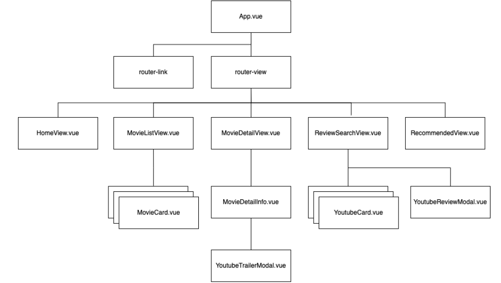

# Vue를 활용한 영화 추천 사이트 제작

## 프로젝트 설명

### 동기
- 영화 데이터를 API로 받아와 소개하고 AJAX 통신과 AXIOS 비동기를 통하여 기능들을 구현하며 Vue Router를 통해 Single Page 에서 페이지가 이동하는 경험을 제공하는 영화 추천 사이트를 제작하고자 목표를 두었습니다.

### 코드 사용방법

1. 최고 평점 영화 조회

#### index.js


- Single Page에서 Router를 활용하여 유저에게 페이지 이동 경험을 주기 위해 index.js 페이지에 각각의 url에 대해서 정의 해준다.

#### 네비게이션 바


- 네비게이션 바를 디자인하고 네브바를 활용하여 RouterLink로 원하는 페이지로 이동시켜준다



- 네브바에서 RouterLink를 연결시켰기 때문에 App에 Nav 바를 import 하여 출력한다.


- TMDB API 중 인기순 영화 정보 API를 받아오는데 이 때 url과 headers를 통해서 api 데이터를 전달한다.
- 비동기 axios를 통해서 비동기에 대한 결과를 전달하고 비동기 데이터가 성공할 경우 then을 통해 10가지 데이터를 전달하고 실패할 경우 catch로 넘어가 경고 메세지를 준다.


- 각각의 영화 정보를 v-for를 통해서 만들어둔 카드 component에 전달하여 컴포넌트를 뷰에 출력하게 import 한다.


#### 영화 카드 Component


- props로 전달받은 정보들에 대해 카드의 형태로 title overview poster에 대한 이미지 링크 등을 받아 출력해준다.

### 2. 영화 디테일 페이지

#### 영화 Detail View


- TMDB API를 받아오고 각각 영화에 대한 정보를 받아온다.
- template는 MovieDetailInfo 컴포넌트를 통해 작성한다.


- MovieDetailInfo 컴포넌트에선 전달받은 props에 대해서 URL을 전달받는 메서드를 정의하고 라이프사이클 훅을 통해 정보를 출력해준다.
- 그 영화 대한 트레일러를 알기 위하여 YoutubeTrailerModal 컴포넌트를 출력한다.

#### 유튜브 API


- Youtube API를 받아와 유튜브를 통해서 영화 공식 예고편을 출력해준다.
- 영화 예고편을 출력 받기 위해 Movie Title을 props로 받아오고 검색 시 전달 정보에 + 공식 예고편을 추가하여 공식 예고편을 1개 모달을 통해 출력해준다.

### 3. 영화 리뷰 영상 조회

#### 영화 검색


- 유튜브 API를 받아와 영상 정보를 출력할 수 있게 하고 검색기능을 활성화 하기 위해서 썸네일, 타이틀 등을 props로 전달해주었다.
- 클릭 했을 시 모달을 출력하게 emit으로 메서드를 넘겨주었다.

### 4. 현재 날씨에 따른 영화 추천

#### 영화 추천


```
{"genres":[{"id":28,"name":"Action"},{"id":12,"name":"Adventure"},{"id":16,"name":"Animation"},{"id":35,"name":"Comedy"},{"id":80,"name":"Crime"},{"id":99,"name":"Documentary"},{"id":18,"name":"Drama"},{"id":10751,"name":"Family"},{"id":14,"name":"Fantasy"},{"id":36,"name":"History"},{"id":27,"name":"Horror"},{"id":10402,"name":"Music"},{"id":9648,"name":"Mystery"},{"id":10749,"name":"Romance"},{"id":878,"name":"Science Fiction"},{"id":10770,"name":"TV Movie"},{"id":53,"name":"Thriller"},{"id":10752,"name":"War"},{"id":37,"name":"Western"}]}
```
- 날씨에 맞게 영화 장르를 결정하고 랜덤으로 그 장르에 맞는 영화를 출력했다.
- 날씨 정보를 위해 API를 받아왔다
- 마찬가지로 영화에 대한 정보이기 때문에 유튜브 공식 트레일러를 출력할 수 있게 해주었다.

### 최종 결과물


### 컴포넌트 구조



### 사용한 app frame work
- Vue 3
- Node.js 20.9.0
- Vite 20+

### 팀원
- 김선욱 (Instagram : @ws_960 / github : https://github.com/Woogie-Gim)